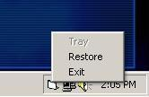



## SysTray With Popup Menu And OnTop

### Description

Put an icon in the system tray with popup menus without any ocx or dll. Updated to include the option of having your program be on top of all others, very simple to use. I'm not really worried about votes, but if this code helps someone new to Visual Basic I would like to hear a comment if it's not too much trouble.
 
### More Info
 

             |
---                |---
**Submitted On**   |2001-06-23 02:50:56
**By**             |[AutoBot](https://github.com/Planet-Source-Code/PSCIndex/blob/master/ByAuthor/autobot.md)
**Level**          |Beginner
**User Rating**    |3.5 (14 globes from 4 users)
**Compatibility**  |VB 5\.0, VB 6\.0
**Category**       |[Custom Controls/ Forms/  Menus](https://github.com/Planet-Source-Code/PSCIndex/blob/master/ByCategory/custom-controls-forms-menus__1-4.md)
**World**          |[Visual Basic](https://github.com/Planet-Source-Code/PSCIndex/blob/master/ByWorld/visual-basic.md)
**Archive File**   |[SysTray Wi215416232001\.zip](https://github.com/Planet-Source-Code/autobot-systray-with-popup-menu-and-ontop__1-24335/archive/master.zip)

